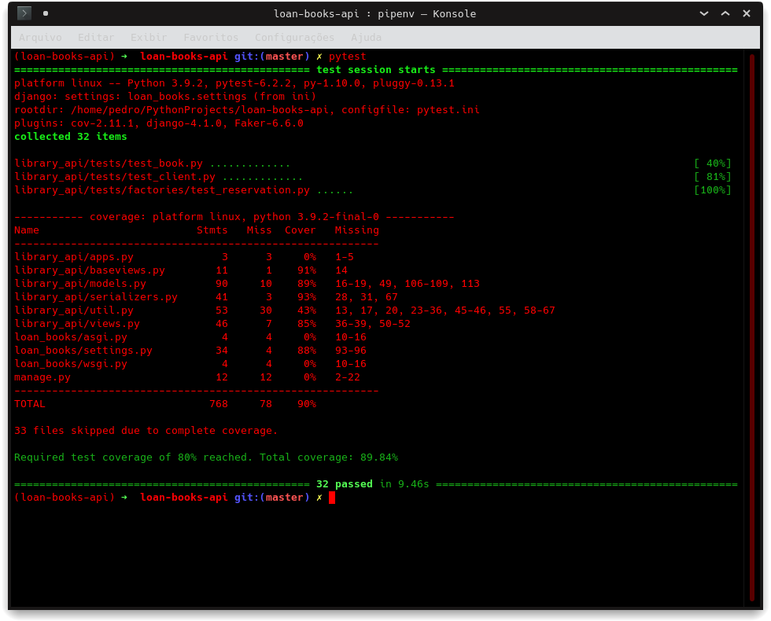

# loan-books-api

API Rest para uma livraria online.

[](https://github.com/SousaPedro11/loan-books-api/actions/workflows/django.yml)

# Problema

O usuário pode gerenciar livros, reservas de livro e clientes. O tempo padrão para cada reserva são três dias. Deverá
ser calculada uma multa e juros ao dia sobre o valor da reserva, de acordo com as seguintes regras:

| Dias de Atraso  |  Multa  | Juros ao dia
| ------------------- | ------------------- | ------------------- |
| Sem Atraso |  0 |  0%
|  Até 3 dias |  3% | 0.2%
|  Acimca de 3 dias |  5% | 0.4%
|  Acima de 5 dias |  7% | 0.6%

## Forma de cálculo

Os cálculos serão feitos de forma não linear, visto que os juros são variáveis. Portanto, os juros serão fragmentados
por período.

Caso tenha 3 dias, os juros serão calculados a partir desse. Caso tenha 5 dias, os juros serão a soma da regra para os 3
dias mais a regra para a diferença dos períodos das duas regras.

Tanto os valores fixos por intervalo quanto os vaiáveis por dia serão calculados a partir do valor base.

# API v1

## Livros

- GET - /api/v1/book/ - obtém uma lista de livros;
- POST - /api/v1/book/ - cadastra um livro;
- GET - /api/v1/book/{id}/ - obtém um livro específico (id);
- PUT - /api/v1/book/{id}/ - atualiza um livro específico (id);
- PATCH - /api/v1/book/{id}/ - atualiza parcialmente um livro específico (id);
- DELETE - /api/v1/book/{id}/ - deleta um livro específico.

### SCHEMA

Exemplos do POST body:

````json
{
  "title": "Fluent Python",
  "author": "Luciano Ramalho",
  "edition": 1,
  "pages": 800,
  "reservation_price": 50,
  "reserved": false
}
````

````json
{
  "title": "INTRODUÇÃO À PROGRAMAÇÃO COM PYTHON",
  "subtitle": "ALGORITMOS E LÓGICA DE PROGRAMAÇÃO PARA INICIANTES",
  "author": "NILO NEY COUTINHO MENEZES",
  "isbn": "978-85-7522-718-3",
  "edition": 1,
  "pages": 328,
  "reservation_price": 10
}
````

Exemplo do GET (all)

````json
{
  "count": 5,
  "next": null,
  "previous": null,
  "results": [
    {
      "id": 3,
      "title": "ARTE DA GUERRA",
      "subtitle": null,
      "author": "SUN TZU",
      "isbn": null,
      "edition": 1,
      "pages": 0,
      "reservation_price": "35.00",
      "reserved": true
    },
    {
      "id": 5,
      "title": "CLEAN CODE",
      "subtitle": null,
      "author": "TIO BOB :)",
      "isbn": null,
      "edition": 1,
      "pages": 0,
      "reservation_price": "300.00",
      "reserved": true
    },
    {
      "id": 1,
      "title": "FLUENT PYTHON",
      "subtitle": null,
      "author": "LUCIANO RAMALHO",
      "isbn": null,
      "edition": 1,
      "pages": 800,
      "reservation_price": "50.00",
      "reserved": true
    },
    {
      "id": 2,
      "title": "INTRODUÇÃO À PROGRAMAÇÃO COM PYTHON",
      "subtitle": "ALGORITMOS E LÓGICA DE PROGRAMAÇÃO PARA INICIANTES",
      "author": "NILO NEY COUTINHO MENEZES",
      "isbn": "978-85-7522-718-3",
      "edition": 1,
      "pages": 328,
      "reservation_price": "10.00",
      "reserved": true
    },
    {
      "id": 4,
      "title": "SCRUM",
      "subtitle": null,
      "author": "JEFF",
      "isbn": null,
      "edition": 1,
      "pages": 0,
      "reservation_price": "30.00",
      "reserved": true
    }
  ]
}
````

## Cliente

- GET - /api/v1/client/ - obtém uma lista de clientes;
- GET - /api/v1/client/{id}/books/ - obtém uma lista de reservas para o cliente específico (id) com os valores de multas
  se houver.
- POST - /api/v1/client/ - cadastra um cliente;
- GET - /api/v1/client/{id}/ - obtém um cliente específico (id);
- DELETE - /api/v1/client/{id}/ - deleta um cliente específico.

### SCHEMA

Exemplos do POST body:

````json
{
  "name": "Cesar Passos",
  "username": "cezar_Passos",
  "email": "cezar.passos@email.com"
}
````

Exemplos do GET (all):

````json
{
  "count": 3,
  "next": null,
  "previous": null,
  "results": [
    {
      "id": 2,
      "name": "Cesar Augusto",
      "username": "cezar_augusto",
      "email": "cezar@email.com"
    },
    {
      "id": 3,
      "name": "Cesar Passos",
      "username": "cezar_Passos",
      "email": "cezar.passos@email.com"
    },
    {
      "id": 1,
      "name": "Pedro",
      "username": "sousapedro11",
      "email": "pedro@email.com"
    }
  ]
}
````

## Reserva de Livro

- POST - /api/v1/book/{id}/reserve/ - reseva o livro específico (id), enviar pelo body da requisição o id do cliente;
- GET - /api/v1/reservation/ - obtém a lista das reservas existentes
- POST - /api/v1/reservation/ - cadastra uma reserva a um cliente
- GET - /api/v1/reservation/{id}/ - obtém detalhe de uma reserva
- PUT - /api/v1/reservation/{id}/ - atualiza uma reserva específica
- PATCH - /api/v1/reservation/{id}/ - atualiza parcialmente uma reserva específica
- DELETE - /api/v1/reservation/{id}/ - deleta uma reserva específica

Exemplo para "/api/v1/book/{id}/reserve/":

```json
{
  "client": 1
}
```

Exemplo de objeto Lista de Reservas de um cliente "/api/v1/client/{id}/book/":

```json
[
  {
    "id": 1,
    "book": "CLEAN CODE, TIO BOB :), Ed 1",
    "client": "sousapedro11",
    "reserved_at": "2021-03-12",
    "returned_at": null,
    "active": true,
    "delayed_days": 0,
    "price": 300.0,
    "total_price": 0.0
  },
  {
    "id": 2,
    "book": "FLUENT PYTHON, LUCIANO RAMALHO, Ed 1",
    "client": "sousapedro11",
    "reserved_at": "2021-03-12",
    "returned_at": null,
    "active": true,
    "delayed_days": 0,
    "price": 50.0,
    "total_price": 0.0
  },
  {
    "id": 3,
    "book": "INTRODUÇÃO À PROGRAMAÇÃO COM PYTHON, NILO NEY COUTINHO MENEZES, Ed 1",
    "client": "sousapedro11",
    "reserved_at": "2021-03-12",
    "returned_at": null,
    "active": true,
    "delayed_days": 0,
    "price": 10.0,
    "total_price": 0.0
  }
]
```

Exemplo de objeto Lista de Reservas de todos os clientes "/api/v1/reservation/":

```json
{
  "count": 5,
  "next": null,
  "previous": null,
  "results": [
    {
      "id": 4,
      "book": "ARTE DA GUERRA, SUN TZU, Ed 1",
      "client": "cezar_augusto",
      "reserved_at": "2021-03-12",
      "returned_at": null,
      "active": true,
      "delayed_days": 0,
      "price": 35.0,
      "total_price": 0.0
    },
    {
      "id": 1,
      "book": "CLEAN CODE, TIO BOB :), Ed 1",
      "client": "sousapedro11",
      "reserved_at": "2021-03-12",
      "returned_at": null,
      "active": true,
      "delayed_days": 0,
      "price": 300.0,
      "total_price": 0.0
    },
    {
      "id": 2,
      "book": "FLUENT PYTHON, LUCIANO RAMALHO, Ed 1",
      "client": "sousapedro11",
      "reserved_at": "2021-03-12",
      "returned_at": null,
      "active": true,
      "delayed_days": 0,
      "price": 50.0,
      "total_price": 0.0
    },
    {
      "id": 3,
      "book": "INTRODUÇÃO À PROGRAMAÇÃO COM PYTHON, NILO NEY COUTINHO MENEZES, Ed 1",
      "client": "sousapedro11",
      "reserved_at": "2021-03-12",
      "returned_at": null,
      "active": true,
      "delayed_days": 0,
      "price": 10.0,
      "total_price": 0.0
    },
    {
      "id": 5,
      "book": "SCRUM, JEFF, Ed 1",
      "client": "cezar_Passos",
      "reserved_at": "2021-03-12",
      "returned_at": null,
      "active": true,
      "delayed_days": 0,
      "price": 30.0,
      "total_price": 0.0
    }
  ]
}
```

## Swagger

Foi implementado a documentação das rotas da API via Swagger

- GET - /api/v1/openapi/ - documantação no swagger

# Instalação

Clone o projeto repositório:

```bash
git https://github.com/SousaPedro11/loan-books-api/
```

## Variáveis de ambiente

Para configurar algumas variáveis de ambiente, editar o arquivo [env-example](env-example) na raiz do projeto como
***.env***.

## Preparação do ambiente

* instalar o Python
* instalar o pipenv utilizando o pip

  No Linux seria: ```sudo pip install pipenv```
* clonar o projeto
    ```shell
    git clone https://github.com/SousaPedro11/loan-books-api/
    ```
* mude para o diretório raiz do projeto

### Usando Pipenv

* criar o abiente virtual
    * verificar e se preciso alterar para 3.8 a versão do Python no arquivo [Pipfile](Pipfile)
    * criar o ambiente com: ```pipenv --three```
* instalar dependências
    * entrar no shell do pipenv: ```pipenv shell```
    * instalar dependencias com: ```pipenv install```

### Usando pip

* criar o abiente virtual
  ```shell
  python -m venv venv
  ```
* Ativar o ambiente virtual
    * No Linux
      ```shell
      source ./venv/bin/activate
      ```
    * No Windows
      ```
      source .\venv\Scripts\activate
      ```
* instalar dependências
    * instalar dependencias com: ```pip install -r requirements.txt```

## Execute as migrações:

`````bash
python manage.py migrate
`````

## Testes unitários:

### Sem mostrar coverage
```bash
python manage.py test --verbosity 3
```

### Mostrando coverage
- Apenas mostrando testcases, status e coverage
```bash
pytest
```
ou
- Mostrando todas as informações (modo verboso)
```bash
pytest -vvv
```

### Status atual de Coverage



## Executar o projeto

`````bash
python manage.py runserver
`````

## Docker

Em breve

## Docker-compose

Em breve

# Deploy

Foi implementado workflow de CI/CD com GitHub + Heroku

Link da aplicação: [loan-books-api](https://loan-books-api.herokuapp.com/api/v1/openapi/#/)
